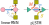

# pLSTM: parallelizable Linear Source Transition Mark Networks - Experiments
[](https://arxiv.org/abs/2506.11997)
[](https://opensource.org/licenses/MIT)

Korbinian Pöppel<sup>**1,2**</sup>, Richard Freinschlag<sup>**1**</sup>, Thomas Schmied<sup>**1**</sup>, Wei Lin<sup>**1**</sup>,, Sepp Hochreiter<sup>**1,2**</sup> 

<sup>**1**</sup>ELLIS Unit Linz and LIT AI Lab, Institute for Machine Learning, Johannes Kepler University Linz, Austria\
<sup>**2**</sup>NXAI GmbH, Linz, Austria


This is the main experimentation repository for [pLSTM](https://arxiv.org/abs/2506.11997) - parallelizable Linear Source Transition Mark networks.
pLSTMs inherit ideas from Multi-Dimensional RNNs [Graves et al. 2007](http://arxiv.org/abs/0705.2011) and linear RNNs.
With the linearity, and changing the gating structure to the Source, Transition and Mark gates, we introduce a multi-dimensional parallel associative scan, on general directed acyclic graphs (DAGs) for parallelization.



pLSTMs also solve the vanishing/exploding gradient/activation problem on DAGs, similar to how the LSTM tackled them for RNNs on sequences.

## Overview
This repository integrates the core paper's contributions:
- the pLSTM core implementation: [https://github.com/ml-jku/plstm](https://github.com/ml-jku/plstm)
- the arrow pointing extrapolation task implementation: [https://github.com/ml-jku/arrow_pointing_extrapolation](https://github.com/ml-jku/arrow_pointing_extrapolation)
using the folling setup:
- compositional configuration with dataclasses via `compoconf`: [https://github.com/kpoeppel/compoconf](https://github.com/kpoeppel/compoconf) 
- a `jax_trainer` based on Phillip Lippe's base: [https://github.com/kpoeppel/jax_trainer](https://github.com/kpoeppel/jax_trainer)
- adaptions of Jungwoo Park's Deit III training code [https://github.com/affjljoo3581/deit3-jax](https://github.com/affjljoo3581/deit3-jax)

## Installation

How to re-produce the original training setup:
```
conda env create -n plstm -f environment_jax_torch.yaml
# install plstm
git clone https://github.com/ml-jku/plstm
pip install -e './plstm[jax,torch]
# install arrow_pointing_dataset
git clone https://github.com/ml-jku/arrow_pointing_dataset
pip install -e './arrow_pointing_dataset[torch]
# install mill (preprocessing, not strictly required)
git clone https://github.com/kpoeppel/mill
pip install -e './mill'
# install jax_trainer (used for configuration of optimizer)
git clone https://github.com/kpoeppel/jax_trainer
pip install -e './jax_trainer'
git clone https://github.com/ml-jku/plstm_experiments
```


## Re-running experiments
Basically this is a wrapper around the plstm repo enhanced with some training functionality, that contains the necessary configs to make it run.
Adapted from [deit3-jax](https://github.com/affjljoo3581/deit3-jax).

You can use common hydra overrides, while the result will not be run in hydra itself.
Most configs are typed, so despite the many options, it should be a little bit harder to mess things up. (Except for bad numerical values).

```
PYTHONPATH=. python3 scripts/run_experiment_simplified.py --config_name experiments/spl/arrow_pointing_extrapolation model=vit
```

```
PYTHONPATH=. python3 scripts/run_experiment_simplified.py --config_name experiments/spl/arrow_pointing_extrapolation model=plstm_vision
```

Take a look into the `config/` folder to get an overview of the structure.

### Re-running graph experiments
See sub-folder `plstm_graph`.

### Re-running baselines on arrow pointing extrapolation in PyTorch
For the Mamba2D and 2DMamba experiments on Arrow Pointing Extrapolation, you have to clone the respective repos (see `src/model_wrappers_torch.py`) and install
their package.

## Arrow Pointing Extrapolation dataset
The arrow pointing extrapolation dataset is available [here](https://github.com/ml-jku/arrow_pointing_dataset) for arbitrary generation, and available on [HuggingFace](https://huggingface.co/ml-jku/arrow_pointing_extrapolation) with the the exact images used in the experiments of the paper.

## Sequence modeling experiments
The paper's focus is on multi-dimensional settings, but for sequences pLSTMs are also a bit different in their gating compared to existing linear RNNs. Also, out implementation allows for state-tracking extension as in [Merrill et al. 2024](https://arxiv.org/abs/2404.08819), because it allows for non-diagonal transition. In our implementation, you can tune the different state-tracking dimensions (`JS`, `JT`, `JM`). 
Feel free to test our models on this, we are curious about your results! :)


## License

MIT License

## References
MD-RNNs: 
- Graves et al. 2007: Multi-Dimensional Recurrent Neural Networks [http://arxiv.org/abs/0705.2011](http://arxiv.org/abs/0705.2011)

linear RNNs (among lots of others):
- Schlag et al. 2021: Linear Transformers are Secretly Fast Weight Programmers [http://arxiv.org/abs/2102.11174](http://arxiv.org/abs/2102.11174)
- Orvieto et al. 2023: Resurrecting Recurrent Neural Networks for Long Sequences [http://arxiv.org/abs/2303.06349](http://arxiv.org/abs/2303.06349)
- Gu and Dao 2023: Mamba: Linear-time sequence modeling with selective state spaces [http://arxiv.org/abs/2312.00752](http://arxiv.org/abs/2312.00752)
- Yang et el. 2023: Gated Linear Attention Transformers with Hardware-Efficient Training [http://arxiv.org/abs/2312.06635](http://arxiv.org/abs/2312.06635)
- Beck et al. 2024: xLSTM: Extended Long Short Term Memory [http://arxiv.org/abs/2405.04517](http://arxiv.org/abs/2405.04517)

State-Tracking:
- Merrill et al. 2024: The Illusion of State in State Space Models [https://arxiv.org/abs/2404.08819](https://arxiv.org/abs/2404.08819)

## Citation

If you use this dataset in your research, please cite:

```bibtex

@misc{poppel_plstm_2025,
	title = {{pLSTM}: parallelizable {Linear} {Source} {Transition} {Mark} networks},
	shorttitle = {{pLSTM}},
	url = {http://arxiv.org/abs/2506.11997},
	doi = {10.48550/arXiv.2506.11997},
	urldate = {2025-06-16},
	publisher = {arXiv},
	author = {Pöppel, Korbinian and Freinschlag, Richard and Schmied, Thomas and Lin, Wei and Hochreiter, Sepp},
	month = jun,
	year = {2025},
	note = {arXiv:2506.11997 [cs]},
	keywords = {Computer Science - Machine Learning, Statistics - Machine Learning},
}


```
